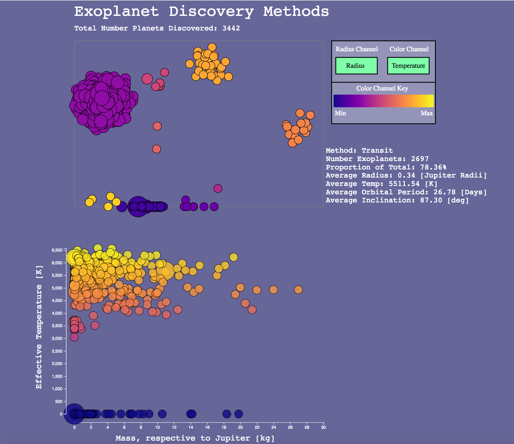
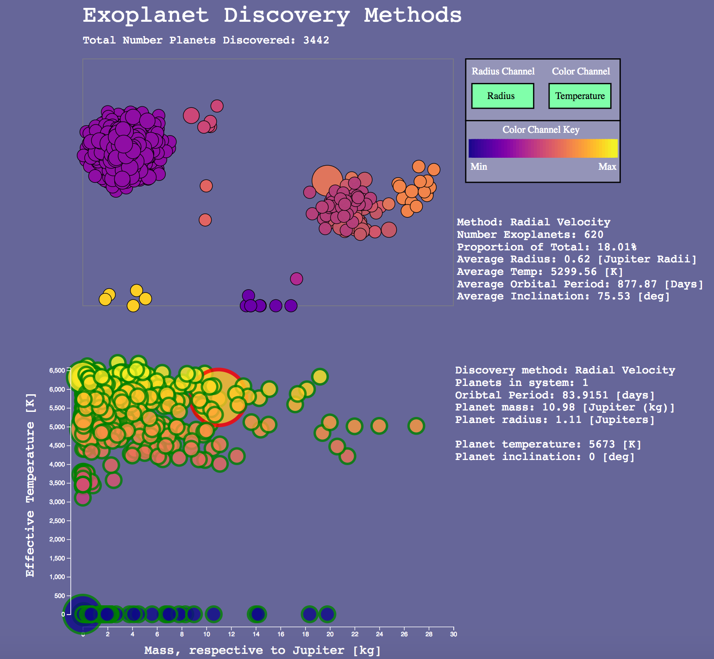
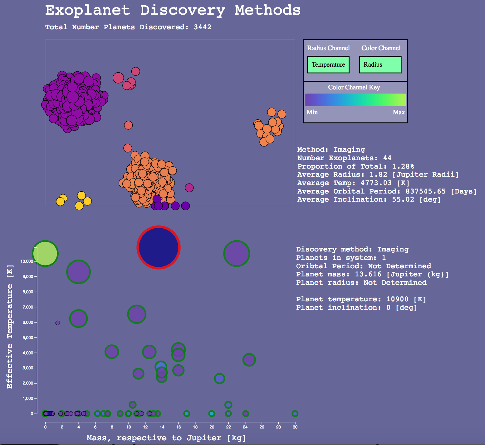

# Exoplanet Visualization

This visualization tool enables the user to explore exoplanets datasets. After importing the dataset, an overview is provided in the top panel wherein discovered exoplanets are grouped by discovery method (e.g., Transit method) and randomly color-coded by this grouping. Note, the color channel in the overview is simply to reinforce the grouping whereas the color channel is mapped to dataset features in the discovery / exploration aspects discussed later. In the overview, each circle represents a single exoplanet. When a group is selected and filtered to the bottom frame, each circle retains its mapping to its respective exoplanet; that is, a single circle always represents the single data point corresponding to a detected and confirmed exoplanet.

Mouseover of a group in the overview frame will highlight the group and expand it, visually accentuating the group of interest, as well as a summary statistic being offered on the right-hand side. This summary includes the discovery type, number of exoplanets in the group, average radii, temperatures, etc. for the group, in addition to the proportion of the dataset that this grouping constitutes.

</img>

Clicking a group filters it down into the bottom-frame of the visualization for a more detailed inspection of the grouping. Note: multiple groupings can simultaneously be selected and filtered into the bottom-frame. Mouseover of a group in the bottom frame will both highlight and expand it, enabling the user to keep track of exoplanets belonging to a particular group whilst interspersed with other groups during comparisons. Further, the mouseover in the bottom frame will display additional information to the right-hand side specific to the individual exoplanet; for instance, the information may contain the temperature, number of additional exoplanets known to exist in that particular system, planet inclination, etc.

The bottom frame is predetermined to encode the spatial-dimension channels to exoplanet effective temperature (in the y dimension) and exoplanet mass (in the x dimension). This enables the user a visual sense of the distribution of planets inter- and intra-group across temperature and mass. Future implementations will enable the spatial channel to vary over features of choice to explore relationships of potential interest.

Clicking a group whilst it is in the bottom frame returns it to the top frame.

</img>

Lastly, the mark's (i.e., the circle representing the exoplanet) radius and color channels can be varied across radius and temperature for both channels. A color channel key is provided below these toggles to keep track of the color mappings.

Specifically, this means that when the radius channel is set to represent the radius, the exoplanet's radius is mapped to the radius of the circle to provide a visual sense of the exoplanet radii distributions within a group, also allowing for intergroup comparisons between methods and the planet sizes they are capable of detecting. Similarly, switching the mark's radius channel to color switches the mapping to the exoplanet's temperature - that is, a small radii corresponds to the cooler temperature exoplanets in the group whereas the larger radii correspond to the hotter temperature exoplanets.

</img>
